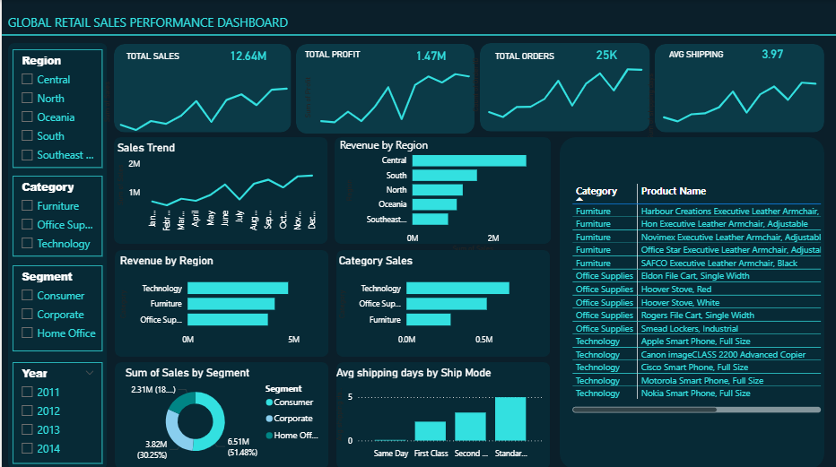

Project Overview

This project analyzes global retail sales data to identify key business trends, high-performing product categories, regional revenue distribution, and customer purchasing behavior.

Using SQL, Python (Pandas), and Power BI, the project demonstrates how data analysts transform raw data into actionable business insights through data cleaning, aggregation, and interactive dashboard visualization.

Tools & Technologies
SQL (DuckDB)
Python (Pandas)
Google Sheets
Power BI
Business Questions Answered

What is the monthly sales trend over time?

Which regions generate the highest revenue?

Which product categories generate the highest sales?

Which categories are the most profitable?

Which individual products generate the highest revenue?

Which shipping mode delivers products fastest?

Which customer segment contributes the most revenue?

What are the top revenue-generating products?

Data Analysis Workflow

The project followed a typical data analyst workflow:

Data Collection
Data Cleaning using Pandas
SQL Analysis & Aggregations
Business Insight Generation
Power BI Dashboard Visualization
Key Insights

Technology category generates the highest revenue among all product categories.

Consumer segment contributes the largest share of total sales.

Standard shipping has the longest delivery time compared to other shipping modes.

A small number of products contribute significantly to overall revenue, indicating strong product concentration.

Dashboard Features

The interactive Power BI dashboard includes:

Total Sales KPI
Total Profit KPI
Total Orders KPI
Average Shipping Time
Monthly Sales Trend Analysis
Regional Sales Comparison
Category Sales & Profit Analysis
Customer Segment Contribution
Top Revenue Generating Products

Interactive filters allow users to explore the data by:

Region
Category
Segment
Year
Dashboard Preview

Example:

Skills Demonstrated
Data Cleaning
SQL Query Writing
Business KPI Analysis
Data Visualization
Dashboard Design
Analytical Thinking
Project Structure
global-retail-sales-dashboard
│
├── data
│   └── dataset_sample.csv
│
├── sql
│   └── analysis_queries.sql
│
├── python
│   └── data_cleaning.ipynb
│
├── dashboard
│   └── retail_sales_dashboard.pbix
│
├── images
│   └── dashboard_preview.png
│
└── README.md
Why This Project

This project demonstrates the end-to-end workflow of a data analyst, from raw data processing to business insights and dashboard development.
